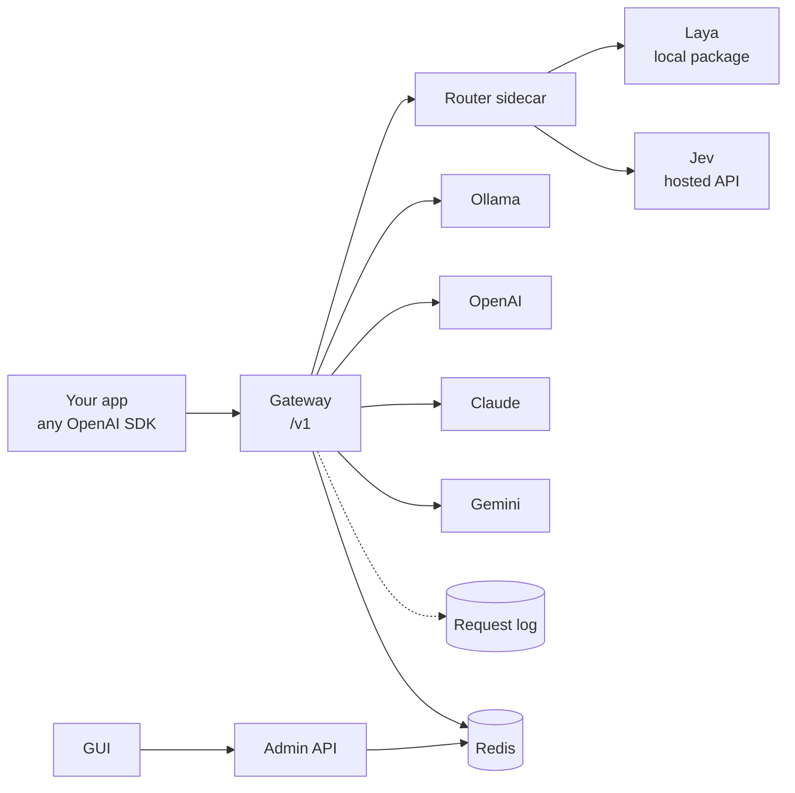

<p align="center">
  
</p>

<p align="center">
  <a href="README.md">English</a> · <b>فارسی</b>
</p>

<p align="center">
  <a href="LICENSE"></a>
  
  
  
  
</p>

<!-- Editing note: this file is right-to-left only inside the dir="rtl" div blocks. Keep Persian text inside them and keep code blocks outside them, so code stays left-to-right. -->

<div dir="rtl">

**Routapse** یک مسیریاب (router) متن‌باز برای مدل‌های زبانی بزرگ (LLM) است. یک مدل مسیریاب کوچک (**Laya** یا **Jev**)
هر پرامپت را می‌خواند و تصمیم می‌گیرد آن را کجا بفرستد: کدام LLM، کدام ایجنت تخصصی، یا حتی پاسخ مستقیم بدون فراخوانی
هیچ مدلی. مدل‌ها می‌توانند محلی (Ollama) یا ابری (OpenAI، Claude، Gemini و هر سرور سازگار با OpenAI) باشند.

مسیرها را با زبان ساده در یک رابط گرافیکی (GUI) تعریف می‌کنید و برنامه‌تان فقط یک endpoint سازگار با OpenAI را صدا می‌زند.

## چرا Routapse

- **هزینه کمتر.** سلام‌واحوال‌پرسی و سؤال‌های ساده به مدل کوچک می‌روند و فقط پرامپت‌های سخت به مدل گران‌قیمت می‌رسند.
- **یک endpoint، چند متخصص.** ایجنت‌هایی مثل برنامه‌نویس، پژوهشگر، نویسنده یا بازبین حقوقی تعریف کنید و بگذارید مسیریاب
  انتخاب کند چه کسی پاسخ بدهد.
- **داده‌ی حساس محلی بماند.** پرامپت‌های حساس را به مدل محلی بفرستید و فقط بقیه را به مدل ابری.
- **پیش از پرداخت هزینه، کنترل کنید.** رد درخواست، ارجاع به انسان یا پاسخ از قالب ثابت، قبل از آنکه هیچ LLM فراخوانی شود.
- **همه‌چیز را ببینید.** هر درخواست، تصمیم مسیریاب و پاسخ در لاگی قابل جستجو ذخیره می‌شود.

## قابلیت‌ها

| قابلیت | توضیح |
|---|---|
| **مسیریاب‌ها با زبان ساده** | هر مسیر (lane) را با چند جمله توضیح می‌دهید و مدلش را با یک کلیک انتخاب می‌کنید. سه قالب آماده: لایه‌بندی هزینه، ایجنت‌های تخصصی، گاردریل. |
| **سیگنال‌ها و قوانین** | Laya و Jev در همان فراخوانی به سؤال‌های اضافه (فوریت، احتمال ترک سرویس، حساس بودن) هم پاسخ می‌دهند و قوانین، آن پاسخ‌ها را به مسیریابی تبدیل می‌کنند. |
| **Gateway سازگار با OpenAI** | با هر SDK ی OpenAI کار می‌کند: ‎`model="router:<id>"`‎. یک endpoint فقط-طبقه‌بندی هم دارد که هیچ LLM ای صدا نمی‌زند. |
| **ارائه‌دهندگان متعدد** | Ollama، OpenAI، Claude (Anthropic)، Gemini و هر سرور سازگار با OpenAI. |
| **کشف خودکار Ollama** | مدل‌های نصب‌شده روی دستگاهتان را پیدا می‌کند و با یک کلیک وصل می‌کند. |
| **Prompt Studio** | پرامپت بنویسید و از طریق یک مسیریاب ذخیره‌شده بفرستید، مسیر را اجباری کنید، تصمیم را پیش‌نمایش ببینید و پرامپت‌ها را ذخیره کنید. |
| **لاگ درخواست‌ها** | هر درخواست و پاسخ در فایل‌های JSONL روزانه، به‌همراه صفحه‌ی لاگ قابل جستجو. |
| **مقیاس‌پذیر** | Gateway، API مدیریت، sidecar مسیریاب و GUI سرویس‌های جدا هستند و تنظیمات در Redis نگهداری می‌شود. |

## نحوه‌ی کار

</div>



<div dir="rtl">

1. برنامه‌ی شما Gateway را با ‎`model="router:<id>"`‎ صدا می‌زند.
2. Gateway از sidecar مسیریاب می‌خواهد یک مسیر انتخاب کند. Laya یا Jev پرامپت را می‌خواند و مسیر را برمی‌گرداند.
3. قوانین (بر پایه‌ی سیگنال‌ها) می‌توانند انتخاب را تغییر دهند. اگر اطمینان پایین باشد، مسیر جایگزین (fallback) استفاده می‌شود.
4. مسیر یا مدل خودش را (با دستورالعمل همان مسیر) صدا می‌زند، یا مستقیم با متن ثابت پاسخ می‌دهد.
5. درخواست، تصمیم و پاسخ لاگ می‌شوند.

## شروع سریع

به Docker و Compose نیاز دارید.

</div>

```bash
git clone https://github.com/<your-username>/routapse.git
cd routapse
cp .env.example .env        # then set ADMIN_TOKEN
docker compose up --build
```

<div dir="rtl">

آدرس **http://localhost:3000** را باز کنید، توکن ادمین را وارد کنید و این مراحل را بروید:

1. **Connections.** اگر Ollama در حال اجراست، Routapse مدل‌های نصب‌شده را فهرست می‌کند و دکمه‌ی *Connect all* می‌دهد.
   ارائه‌دهنده‌های OpenAI، Claude یا Gemini و مدل‌هایشان را هم از همین‌جا اضافه کنید.
2. **Routers.** با *New router* یک مسیریاب بسازید، یک قالب شروع انتخاب کنید، هر مسیر را توضیح دهید، مدلش را انتخاب کنید و
   پیش از ذخیره با یک پرامپت امتحان کنید.
3. **Prompt Studio.** پرامپت‌ها را از طریق هر مسیریاب ذخیره‌شده بفرستید.
4. **Logs.** هر درخواست و تصمیم مسیریاب پشت آن را بررسی کنید.

سپس از کد صدا بزنید:

</div>

```python
from openai import OpenAI

client = OpenAI(base_url="http://localhost:8000/v1", api_key="your-gateway-key-or-anything")
reply = client.chat.completions.create(
    model="router:support-triage",
    messages=[{"role": "user", "content": "We were billed twice for March."}],
)
print(reply.choices[0].message.content)
print(reply.routapse)   # lane, model, confidence, signals, reason
```

<div dir="rtl">

**Ollama و Docker.** کانتینرها از طریق ‎`host.docker.internal`‎ به میزبان دسترسی دارند. Ollama را با
‎`OLLAMA_HOST=0.0.0.0 ollama serve`‎ اجرا کنید. بدون Docker مقدار ‎`OLLAMA_URL=http://localhost:11434`‎ را بگذارید.

**شبکه‌ی کند یا فیلترشده؟** برای استفاده از mirror، متغیرهای ‎`PIP_INDEX_URL`‎، ‎`NPM_REGISTRY`‎، ‎`PYTHON_IMAGE`‎ و ‎`NODE_IMAGE`‎
را در ‎`.env`‎ تنظیم کنید. جزئیات در [docs/fa/configuration.md](docs/fa/configuration.md).

### اجرا بدون Docker

به Python نسخه‌ی 3.11 به بالا و Node نسخه‌ی 18 به بالا نیاز دارید. Redis اختیاری است و یک فایل JSON هم به‌عنوان ذخیره‌ساز کار می‌کند.

</div>

```bash
# 1. router sidecar (install requirements-laya.txt only if you use Laya)
cd router && python -m venv .venv && source .venv/bin/activate
pip install -r requirements.txt            # optionally: -r requirements-laya.txt
uvicorn app.main:app --port 8001

# 2. backend: gateway and admin in one process (ROLE=all)
cd backend && python -m venv .venv && source .venv/bin/activate
pip install -r requirements.txt
ROLE=all STORE_URL=./data/store.json ROUTER_URL=http://localhost:8001 \
OLLAMA_URL=http://localhost:11434 LOG_DIR=./logs ADMIN_TOKEN=change-me \
uvicorn app.main:app --port 8002

# 3. GUI (proxies /api to :8002)
cd frontend && npm install && npm run dev   # http://localhost:5173
```

<div dir="rtl">

در PowerShell ویندوز به‌جای ‎`NAME=value`‎ از ‎`$env:NAME="value"`‎ استفاده کنید. با ‎`ROLE=all`‎ همه‌ی APIهای سازگار با OpenAI روی
پورت 8002 در دسترس‌اند، پس ‎`base_url="http://localhost:8002/v1"`‎ را بگذارید.

## امتحان با پرامپت‌های نمونه

پوشه‌ی [‎`demo/`‎](demo) شامل ۲۸ پرامپت نمونه (انگلیسی و فارسی) و اسکریپت‌هایی است که آن‌ها را روی تنظیمات خودتان اجرا می‌کنند:
دقت مسیریابی، سیگنال‌ها و تأخیر برای هر مسیریاب، برآورد اختیاری هزینه، و همچنین عکس‌های صفحه و ویدیوی ضبط‌شده از GUI به‌صورت خودکار.
راهنمای کامل: [demo/README.fa.md](demo/README.fa.md).

</div>

```bash
python scripts/seed_demo.py --small <alias> --normal <alias> --huge <alias>
python scripts/demo.py --label "my setup"
```

<div dir="rtl">

## مدل‌های مسیریاب

### Laya (محلی، داخل همان پردازش)

Laya یک پکیج Python است، نه یک سرور. sidecar مسیریاب آن را یک‌بار بارگذاری می‌کند و برای هر پرامپت
‎`Router().predict(state, questions)`‎ را صدا می‌زند.

- مسیرهای هر مسیریاب به یک سؤال از نوع ‎`choice`‎ تبدیل می‌شوند (Jev هم همین سؤال را می‌گیرد).
- **سیگنال‌های** اختیاری، سؤال‌های اضافه در همان فراخوانی هستند: ‎`choice`‎، ‎`score`‎ یا ‎`noul`‎ (احتمال اینکه پاسخ «بله» باشد).
  Jev هم از سیگنال‌ها و قوانین پشتیبانی می‌کند.
- **قوانینی** مثل «اگر ‎`churn_risk`‎ حداقل ۰٫۷ بود، به ‎`human`‎ برو» انتخاب عادی را نادیده می‌گیرند.
- فراخوانی اول یک checkpoint دانلود می‌کند. با ‎`LAYA_PRELOAD=1`‎ هر سه checkpoint هنگام راه‌اندازی بارگذاری می‌شوند.

در Docker نصب Laya **اختیاری (opt-in)** است: برای نصب پکیج ‎`laya`‎ در image مسیریاب، مقدار ‎`INSTALL_LAYA=1`‎ را در ‎`.env`‎ بگذارید.
بدون آن، مسیریاب‌هایی که روی Laya تنظیم شده‌اند از الگوریتم جایگزین مبتنی بر کلمات کلیدی استفاده می‌کنند و در فیلد ‎`reason`‎ تصمیم نوشته می‌شود.

### Jev (API میزبانی‌شده)

Jev با همان قالب سؤال‌وجواب Laya و از راه HTTP صدا زده می‌شود: یک درخواست ‎`POST`‎ با ‎`{state, model, questions}`‎ به endpoint
‎`systemone`‎ و یک کلید Bearer.

</div>

```dotenv
JEV_KIND=systemone
JEV_URL=https://api.typesafe.ai/v1/systemone
JEV_MODEL=jev-latest
JEV_API_KEY=your-key
```

<div dir="rtl">

مثل Laya، Jev هم در همان فراخوانی به **سیگنال‌ها** پاسخ می‌دهد و **قوانین** را راه می‌اندازد. مقادیر ‎`JEV_KIND=ollama`‎ و
‎`JEV_KIND=openai_compat`‎ هم برای Jev پشت یک سرور چت وجود دارند؛ آن‌ها فقط می‌توانند مسیر را انتخاب کنند و سیگنال‌ها را نادیده می‌گیرند.

اگر مدل مسیریاب در دسترس نباشد یا خروجی نامعتبر بدهد، یک الگوریتم کلیدواژه‌ای جواب می‌دهد تا Gateway هیچ‌وقت به‌خاطر طبقه‌بندی از کار نیفتد.
هر دو adapter در [‎`router/app/main.py`‎](router/app/main.py) هستند.

## سناریوها

| سناریو | ایده | پیکربندی |
|---|---|---|
| **لایه‌بندی هزینه** | مسیرهای ‎`small`‎ / ‎`normal`‎ / ‎`huge`‎ روی مدل‌های مختلف | [‎`cost-tiers.json`‎](examples/cost-tiers.json) |
| **ایجنت‌های تخصصی** | هر مسیر یک نقش و یک مدل دارد | قالب آماده |
| **گاردریل و تریاژ** | یک مسیر با متن ثابت پاسخ می‌دهد و هیچ LLM ای صدا نمی‌زند | قالب آماده |
| **تریاژ پشتیبانی** | سیگنال‌های فوریت و احتمال ترک سرویس، و یک قانون که به انسان ارجاع می‌دهد | [‎`support-triage.json`‎](examples/support-triage.json) |
| **اول محلی، در صورت نیاز ابری** | سیگنال ‎`sensitive`‎ متن محرمانه را روی مدل محلی نگه می‌دارد | [‎`local-first.json`‎](examples/local-first.json) |
| **فقط طبقه‌بندی** | ‎`POST /v1/route/{id}`‎ مسیر و سیگنال‌ها را بدون صدا زدن LLM برمی‌گرداند | [docs/fa/scenarios.md](docs/fa/scenarios.md) |

جزئیات و مراحل راه‌اندازی: **[docs/fa/scenarios.md](docs/fa/scenarios.md)**. برای بارگذاری یک نمونه، مقدارهای ‎`CHANGE-ME`‎ را با
alias مدل‌هایی که در Connections اضافه کرده‌اید جایگزین کنید و سپس
‎`ADMIN_TOKEN=... ./examples/import.sh examples/support-triage.json`‎ را اجرا کنید.

## Prompt Studio و لاگ‌ها

**Prompt Studio** منوی جداگانه‌ای برای نوشتن و فراخوانی پرامپت‌هاست: یک مسیریاب یا یک مدل مشخص را انتخاب کنید، در صورت لزوم مسیر را اجباری
کنید یا پیش‌نمایش ببینید پرامپت به کجا می‌رود، گفتگوی چندمرحله‌ای داشته باشید و پرامپت‌ها را با مقصدشان ذخیره کنید.

**لاگ‌ها.** هر درخواست و پاسخ به فایل ‎`requests-YYYY-MM-DD.jsonl`‎ اضافه می‌شود (در Docker، volume با نام ‎`logs`‎ روی ‎`/logs`‎). هر خط شامل منبع،
مسیریاب، درخواست، تصمیم مسیریابی، سیگنال‌ها، مدل مقصد، پاسخ، مصرف توکن، وضعیت و تأخیر است. صفحه‌ی Logs بر اساس مسیریاب، منبع و متن فیلتر
می‌کند. با ‎`LOG_BODIES=false`‎ فقط metadata لاگ می‌شود. لاگ‌ها شامل پرامپت‌ها و پاسخ‌ها هستند و خودکار پاک نمی‌شوند.

## API

Gateway (سازگار با OpenAI، و در صورت تنظیم ‎`GATEWAY_API_KEY`‎ با هدر ‎`Authorization: Bearer $GATEWAY_API_KEY`‎):

| Endpoint | کاربرد |
|---|---|
| ‎`POST /v1/chat/completions`‎ | مقدار ‎`model`‎ برابر ‎`router:<id>`‎ یا alias یک مدل است (ارسال مستقیم) |
| ‎`POST /v1/route/{router_id}`‎ | فقط تصمیم مسیریابی و سیگنال‌ها، بدون فراخوانی LLM |
| ‎`GET /v1/models`‎ | مسیریاب‌ها و مدل‌ها |

API مدیریت (با ‎`Authorization: Bearer $ADMIN_TOKEN`‎) به GUI سرویس می‌دهد: ‎`/admin/{providers,models,routers,prompts}`‎، ‎`/admin/test`‎،
‎`/admin/chat`‎، ‎`/admin/logs`‎ و ‎`/admin/ollama/models`‎. مرجع کامل: **[docs/fa/api.md](docs/fa/api.md)**.

## پیکربندی

همه‌چیز با متغیرهای محیطی تنظیم می‌شود (فایل [‎`.env.example`‎](.env.example) را کپی کنید). مهم‌ترین‌ها:

| متغیر | پیش‌فرض | کاربرد |
|---|---|---|
| ‎`ADMIN_TOKEN`‎ | خالی | توکن Bearer برای GUI و API مدیریت. خالی یعنی بدون احراز هویت. |
| ‎`GATEWAY_API_KEY`‎ | خالی | کلید لازم برای ‎`/v1/*`‎. |
| ‎`STORE_URL`‎ | ‎`redis://redis:6379/0`‎ | ذخیره‌ساز تنظیمات: Redis، یا ‎`file:///path/store.json`‎ برای یک replica. |
| ‎`OLLAMA_URL`‎ | ‎`http://host.docker.internal:11434`‎ | جایی که Routapse مدل‌های محلی Ollama را جستجو می‌کند. |
| ‎`INSTALL_LAYA`‎ | ‎`0`‎ | آرگومان build: نصب پکیج ‎`laya`‎ در image مسیریاب. |
| ‎`JEV_KIND`‎، ‎`JEV_URL`‎، ‎`JEV_MODEL`‎، ‎`JEV_API_KEY`‎ | ‎`systemone`‎، آدرس API ی Jev، ‎`jev-latest`‎ | نحوه‌ی اتصال به Jev. |
| ‎`LOG_DIR`‎، ‎`LOG_BODIES`‎ | ‎`logs`‎، ‎`true`‎ | محل لاگ و اینکه متن پرامپت و پاسخ هم لاگ شود یا نه. |

همه‌ی گزینه‌ها: **[docs/fa/configuration.md](docs/fa/configuration.md)**.

## معماری

| سرویس | پورت | نقش |
|---|---|---|
| ‎`gateway`‎ | 8000 | Data plane. بدون state است و می‌توان آن را افقی مقیاس داد. |
| ‎`admin`‎ | 8002 | Control plane: تنظیمات، Prompt Studio، خواندن لاگ، کشف Ollama. |
| ‎`router`‎ | 8001 | sidecar طبقه‌بندی برای Laya و Jev، با الگوریتم جایگزین کلیدواژه‌ای. |
| ‎`frontend`‎ | 3000 | GUI ی React پشت nginx. فقط با ‎`admin`‎ حرف می‌زند. |
| ‎`redis`‎ | | ذخیره‌ساز مشترک تنظیمات. |

‎`gateway`‎ و ‎`admin`‎ یک image هستند که با ‎`ROLE=gateway`‎ یا ‎`ROLE=admin`‎ اجرا می‌شوند (‎`ROLE=all`‎ برای توسعه‌ی محلی).

</div>

```
routapse/
├── backend/
├── router/
├── frontend/
├── examples/
├── demo/
├── scripts/
├── docs/
└── docker-compose.yml
```

<div dir="rtl">

| پوشه | محتوا |
|---|---|
| ‎`backend/`‎ | FastAPI: Gateway، API مدیریت، موتور مسیریابی، adapterهای ارائه‌دهنده و لاگ درخواست |
| ‎`router/`‎ | sidecar مسیریاب: adapterهای Laya (پکیج) و Jev (HTTP) |
| ‎`frontend/`‎ | GUI با React و Vite: مسیریاب‌ها، Prompt Studio، لاگ‌ها و اتصال‌ها |
| ‎`examples/`‎ | پیکربندی‌های آماده‌ی مسیریاب |
| ‎`demo/`‎ | پرامپت‌های نمونه و راهنمای بنچمارک و ضبط دمو |
| ‎`scripts/`‎ | ‎`seed_demo.py`‎، ‎`demo.py`‎ و ‎`capture_demo.py`‎ |
| ‎`docs/`‎ | سناریوها، پیکربندی، مرجع API و فایل‌های تصویری |

## محدودیت‌ها

- Streaming از نظر قالب سازگار است اما توکن‌به‌توکن نیست: کل پاسخ در یک chunk از نوع SSE می‌رسد.
- Tool call، تصویر و سایر بخش‌های غیرمتنی پیام ارسال نمی‌شوند.
- فرض شده سیگنال ‎`score`‎ یک عدد برمی‌گرداند و ‎`choice`‎ ی که اطمینان گزارش نکند، اطمینان ۱٫۰ حساب می‌شود.
  با گزینه‌ی *Route only* در ویرایشگر مسیریاب بررسی کنید نسخه‌ی Laya یا Jev شما چه برمی‌گرداند.
- کلیدهای API به‌صورت متن ساده در ذخیره‌ساز نگهداری می‌شوند. Redis را خصوصی نگه دارید و جلوی سرویس‌ها TLS بگذارید.
- هنوز مجموعه‌ی تست خودکار وجود ندارد. نوشتن تست مشارکت خوش‌آمدی است.

## مشارکت

مشارکت شما خوش‌آمد است. از [CONTRIBUTING.md](CONTRIBUTING.md) شروع کنید (انگلیسی). برای گزارش آسیب‌پذیری به
[SECURITY.md](SECURITY.md) مراجعه کنید.

## مجوز

[MIT](LICENSE)

</div>
