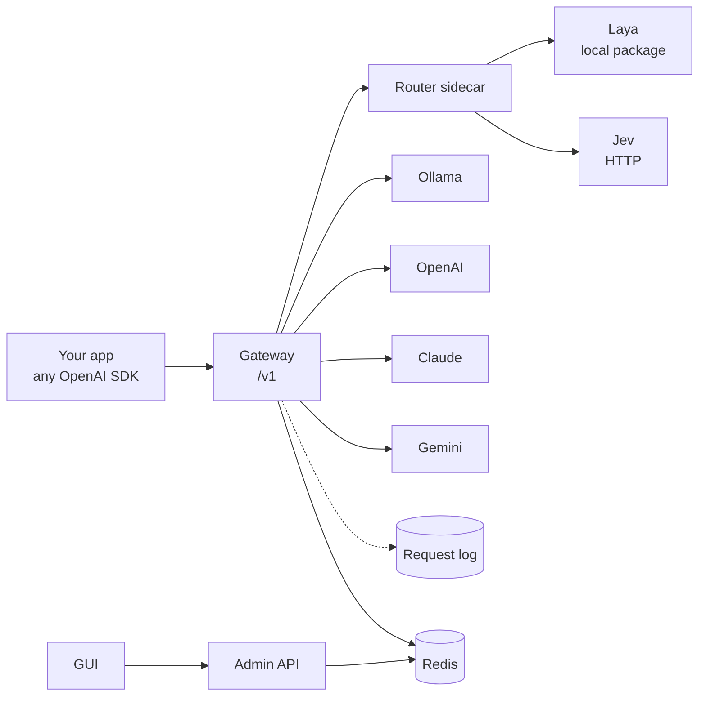

<p align="center">
  
</p>

<p align="center">
  <a href="LICENSE"></a>
  
  
  
  
</p>


**Routapse** is an open-source LLM router. A small router model ([Laya](#router-models) or [Jev](#router-models))
reads each prompt and decides where it goes: which LLM, which specialist agent, or whether to answer
directly without calling a model at all. Models can be local (Ollama) or hosted (OpenAI, Claude, Gemini,
any OpenAI-compatible server).

You describe the routing in plain language in a GUI, then call it through one OpenAI-compatible endpoint.

## Why Routapse

- **Spend less.** Greetings and lookups go to a small model. Only hard prompts reach the expensive one.
- **One endpoint, many specialists.** Define agents (coder, researcher, writer, legal reviewer) and let the
  router pick who answers.
- **Keep data local.** Route sensitive prompts to a local model and send only the rest to the cloud.
- **Guard before you pay.** Refuse, hand off or answer from a template before any LLM is called.
- **See everything.** Every request, decision and response is written to a log you can read and search.

## Features

| | |
|---|---|
| **Routers in plain language** | Describe each lane in words, pick its model with one click. Three starters: cost tiers, specialist agents, guardrails. |
| **Laya signals and rules** | Laya answers extra questions (urgency, churn risk, sensitivity) in the same call. Rules turn them into routing. |
| **OpenAI-compatible gateway** | Works with any OpenAI SDK. Use `model="router:<id>"`. Also a classify-only endpoint with no LLM call. |
| **Many providers** | Ollama, OpenAI, Claude (Anthropic), Gemini, and any OpenAI-compatible server. |
| **Ollama auto-discovery** | Finds the models installed on your machine and connects them in one click. |
| **Prompt studio** | Write and send prompts through a saved router, force a lane, preview the decision, save prompts. |
| **Request log** | Every request and response in daily JSONL files, plus a searchable log page. |
| **Scales apart** | Gateway, admin API, router sidecar and GUI are separate services. Config lives in Redis. |

## How it works
https://github.com/user-attachments/assets/6033e743-056f-44a1-8a1f-571070ce32b0



1. Your app calls the gateway with `model="router:<id>"`.
2. The gateway asks the router sidecar to pick a lane. Laya or Jev reads the prompt and returns a lane.
3. Rules (Laya signals) can override the choice. A low-confidence choice falls back to your fallback lane.
4. The lane either calls its model (with the lane's instructions) or replies directly with fixed text.
5. The request, decision and response are logged.

## Quick start

Requires Docker with Compose.

```bash
git clone https://github.com/<your-username>/routapse.git
cd routapse
cp .env.example .env        # set ADMIN_TOKEN
docker compose up --build
```

Open **http://localhost:3000**, enter your admin token, then:

1. **Connections.** If Ollama is running, Routapse lists the models installed on your machine and offers
   *Connect all*. Add OpenAI, Claude or Gemini providers and their models the same way.
2. **Routers.** Choose *New router*, pick a starting point, describe each lane, choose its model, and test a
   prompt before saving.
3. **Prompt studio.** Send prompts through any saved router.
4. **Logs.** Inspect every request and the routing decision behind it.

Then call it from code:

```python
from openai import OpenAI

client = OpenAI(base_url="http://localhost:8000/v1", api_key="your-gateway-key-or-anything")
reply = client.chat.completions.create(
    model="router:support-triage",
    messages=[{"role": "user", "content": "We were billed twice for March."}],
)
print(reply.choices[0].message.content)
print(reply.routapse)   # lane, model, confidence, signals, reason
```

> **Ollama with Docker.** Containers reach the host through `host.docker.internal`. Start Ollama with
> `OLLAMA_HOST=0.0.0.0 ollama serve`. Without Docker, set `OLLAMA_URL=http://localhost:11434`.
>
> **Slow or blocked network?** Set `PIP_INDEX_URL`, `NPM_REGISTRY`, `PYTHON_IMAGE` and `NODE_IMAGE` in `.env`
> to use mirrors. See [docs/configuration.md](docs/configuration.md).

### Run without Docker

Needs Python 3.11+ and Node 18+. Redis is optional: a JSON file works as the config store.

```bash
# 1. router sidecar (add requirements-laya.txt only if you use Laya)
cd router && python -m venv .venv && source .venv/bin/activate
pip install -r requirements.txt            # and: -r requirements-laya.txt
uvicorn app.main:app --port 8001

# 2. backend: gateway and admin in one process (ROLE=all)
cd backend && python -m venv .venv && source .venv/bin/activate
pip install -r requirements.txt
ROLE=all STORE_URL=./data/store.json ROUTER_URL=http://localhost:8001 \
OLLAMA_URL=http://localhost:11434 LOG_DIR=./logs ADMIN_TOKEN=change-me \
uvicorn app.main:app --port 8002

# 3. GUI (proxies /api to :8002)
cd frontend && npm install && npm run dev   # http://localhost:5173
```

On Windows PowerShell, replace `NAME=value` with `$env:NAME="value"`. With `ROLE=all` the OpenAI-compatible
API is on port 8002. Use `base_url="http://localhost:8002/v1"`.

## Router models

### Laya (local, in-process)

Laya is a Python package, not a server. The router sidecar loads it once and calls
`Router().predict(state, questions)` for each prompt.

- A router's lanes become one `choice` question.
- Optional **signals** become extra questions in the same call: `choice`, `score`, or `noul`
  (probability the answer is yes).
- **Rules** such as "if `churn_risk` is at least 0.7, send to `human`" override the normal choice.
- The first call downloads a checkpoint. `LAYA_PRELOAD=1` loads all three at startup.

Laya is **opt-in in Docker**: build with `INSTALL_LAYA=1` (in `.env`) to install the `laya` package into the router
image. Without it, routers set to Laya use the keyword fallback, and the decision's `reason` says so.

### Jev (HTTP)

Served by Ollama (`JEV_KIND=ollama`) or any OpenAI-compatible server (`JEV_KIND=openai_compat`) at `JEV_URL`
with the model name `JEV_MODEL`. Jev chooses a lane. Signals and rules are Laya features.

If a router model is unavailable or returns something unusable, a keyword heuristic answers so the gateway
never fails on classification. Both adapters live in [`router/app/main.py`](router/app/main.py).

## Scenarios

| Scenario | Idea | Config |
|---|---|---|
| **Cost tiers** | `small` / `normal` / `huge` lanes on different models | [`cost-tiers.json`](examples/cost-tiers.json) |
| **Specialist agents** | Each lane has a role and a model | built-in starter |
| **Guardrails and triage** | A lane replies with fixed text and never calls an LLM | built-in starter |
| **Support triage** | Laya scores urgency and churn risk, a rule escalates to a person | [`support-triage.json`](examples/support-triage.json) |
| **Local first, cloud when needed** | A `sensitive` signal keeps confidential text on a local model | [`local-first.json`](examples/local-first.json) |
| **Classifier only** | `POST /v1/route/{id}` returns the lane and signals without calling an LLM | see [docs/scenarios.md](docs/scenarios.md) |

Details and step-by-step setups: **[docs/scenarios.md](docs/scenarios.md)**. To load an example, edit its
`CHANGE-ME` model aliases to models you added under Connections, then run
`ADMIN_TOKEN=... ./examples/import.sh examples/support-triage.json`.

## Prompt studio and logs

**Prompt studio** is a separate menu for writing and calling prompts: choose a router or a single model, optionally
force a lane or preview where a prompt would go, keep multi-turn chats, and save prompts with their target.

**Logs.** Every request and response is appended to `requests-YYYY-MM-DD.jsonl` (in Docker, the `logs` volume at
`/logs`). Each line holds the source, router, request, routing decision, signals, target model, response, token
usage, status and latency. The Logs page filters by router, source and text. Set `LOG_BODIES=false` to log metadata
only. Logs contain prompts and answers and are kept until you set `LOG_RETENTION_DAYS`.

## API

Gateway (OpenAI-compatible, `Authorization: Bearer $GATEWAY_API_KEY` if set):

| Endpoint | Purpose |
|---|---|
| `POST /v1/chat/completions` | `model` is `router:<id>` or a model alias (direct pass-through) |
| `POST /v1/route/{router_id}` | Routing decision and signals only, no LLM call |
| `GET /v1/models` | Routers and models |

Admin (`Authorization: Bearer $ADMIN_TOKEN`) serves the GUI: `/admin/{providers,models,routers,prompts}`,
`/admin/test`, `/admin/chat`, `/admin/logs`, `/admin/ollama/models`. Full reference:
**[docs/api.md](docs/api.md)**.

## Configuration

Everything is set through environment variables (copy [`.env.example`](.env.example)). The most important:

| Variable | Default | Purpose |
|---|---|---|
| `ADMIN_TOKEN` | empty | Bearer token for the GUI and admin API. Empty means no auth. |
| `GATEWAY_API_KEY` | empty | Require this key on `/v1/*`. |
| `STORE_URL` | `redis://redis:6379/0` | Config store: Redis, or `file:///path/store.json` for one replica. |
| `OLLAMA_URL` | `http://host.docker.internal:11434` | Where Routapse looks for local Ollama models. |
| `INSTALL_LAYA` | `0` | Build arg: install the `laya` package into the router image. |
| `JEV_URL`, `JEV_MODEL`, `JEV_KIND` | | Where Jev is served. |
| `LOG_DIR`, `LOG_BODIES` | `logs`, `true` | Log location, and whether to log prompt and response text. |
| `LOG_RETENTION_DAYS` | `0` | Delete daily log files older than this many days. `0` keeps everything. |

All options: **[docs/configuration.md](docs/configuration.md)**.

## Architecture

| Service | Port | Role |
|---|---|---|
| `gateway` | 8000 | Data plane. Stateless, so you can scale it horizontally. |
| `admin` | 8002 | Control plane: config, prompt studio, log reader, Ollama discovery. |
| `router` | 8001 | Classifier sidecar for Laya and Jev, with a keyword fallback. |
| `frontend` | 3000 | React GUI behind nginx. Talks only to `admin`. |
| `redis` | | Shared config store. |

`gateway` and `admin` are one image started with `ROLE=gateway` or `ROLE=admin` (`ROLE=all` for local development).

```
routapse/
├── backend/      FastAPI: gateway, admin API, routing engine, provider adapters, request log
├── router/       Classifier sidecar: Laya (package) and Jev (HTTP) adapters
├── frontend/     React + Vite GUI: routers, prompt studio, logs, connections
├── examples/     Importable router configs
├── docs/         Scenarios, configuration, API reference, assets
└── docker-compose.yml
```

## Limitations

- Streaming forwards tokens as providers produce them, but is not verified against live providers (tests use
  recorded-style SSE fixtures). Token usage is reported only if the provider sends it.
- Tool calls, images and other non-text message parts are not forwarded.
- Laya's `score` signal is assumed to return a number, and a `choice` without a reported confidence counts as
  confidence 1.0. Use *Route only* in the router editor to check what your Laya version returns.
- API keys are stored in plaintext in the store. Keep Redis private and put TLS in front of the services.
- Tests cover the routing engine, provider adapters, gateway/admin API and router sidecar. Run them with
  `cd backend && STORE_URL=file:///tmp/s.json LOG_DIR=/tmp/l python -m unittest discover -s tests -t .`
  and `cd router && python -m unittest discover -s tests -t .`. Real Laya/Jev and provider calls are not tested.

## Contributing

Contributions are welcome. Start with [CONTRIBUTING.md](CONTRIBUTING.md). To report a vulnerability, see
[SECURITY.md](SECURITY.md).

## License

[MIT](LICENSE)

Email: pooyachavoshi@gmail.com

If you find this project useful, consider giving it a ⭐ to support future development.
