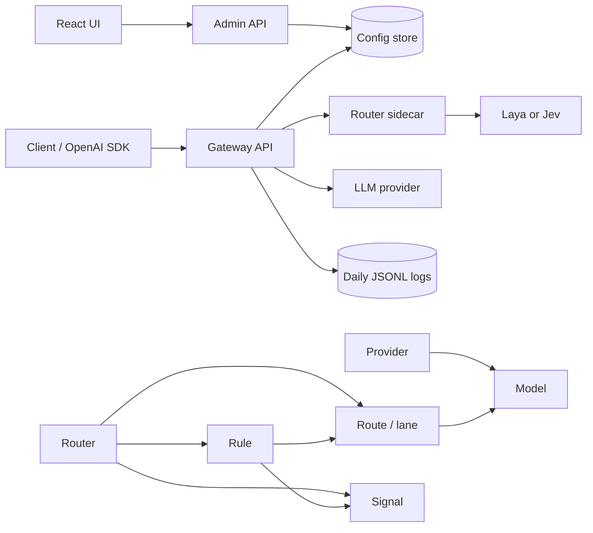

# Architecture and knowledge graph

Routapse has a control plane for configuration, a data plane for inference requests, and a classifier sidecar that chooses the lane for routed requests.

## Domain graph

| Entity | Owns or references | Purpose |
|---|---|---|
| Provider | Models | Connection details for an OpenAI-compatible API, Ollama, Anthropic, or Gemini. |
| Model | Provider | A locally meaningful alias and its provider-side model name. |
| Router | Routes, signals, rules | Defines how requests are classified and which lane to use. |
| Route | Model, optional fallback Model (for `forward`) | A labelled lane. It forwards to a model or returns fixed text (`respond`). |
| Signal | Router | An additional Laya classification output used by rules. |
| Rule | Signal and route | Overrides a classifier choice when a signal comparison matches. |
| Saved prompt | Router or model | Prompt-studio target and initial content. |
| Request log entry | Router, decision, model, response | Immutable audit record for gateway, studio, test, and route-only requests. |

## Request lifecycle

1. A caller uses a model alias directly, or selects a router with `router:<router-id>`.
2. Direct requests resolve the Model, then its Provider. Routed requests first load the Router from the config store.
3. The gateway sends the recent user context, route descriptions, and Laya signals to the router sidecar.
4. The sidecar asks Laya or Jev to choose a label. If it fails or returns an unknown label, it uses the keyword heuristic.
5. The engine applies matching Rules. A low-confidence or invalid choice uses the Router fallback lane.
6. A `respond` lane emits its fixed text. A `forward` lane resolves its Model and Provider, then calls that provider, retrying transient failures per the provider's `timeout` and `retries`. If the model still fails before producing output, the lane's optional fallback Model is tried.
7. For non-streaming requests, the gateway returns an OpenAI-compatible completion. For streaming requests, provider deltas are forwarded as server-sent events.
8. The engine writes one request log record with the decision, response or partial response, usage, status, and latency.

## Invariants

- A forwarding route must reference an existing model when its router is saved.
- Route labels within a router are unique; the optional fallback must name one of them.
- Signals and rules require the Laya router model.
- A route's fallback model must exist and differ from its target model.
- A model cannot be removed while a router route references it (as target or fallback); a provider cannot be removed while a model references it.
- Credentials are masked in Admin API responses, though they are stored as plaintext in the configured store.

## Service boundaries

| Service | Responsibility | State |
|---|---|---|
| `backend` gateway | OpenAI-compatible data plane, routing orchestration, provider calls, request logs | Stateless except log files |
| `backend` admin | Configuration CRUD, prompt studio, log reader, Ollama discovery | Config store |
| `router` | Laya/Jev classification and keyword fallback | In-process Laya cache only |
| `frontend` | Configuration and prompt-studio UI | Browser state |
| Redis or JSON file | Providers, models, routers, saved prompts | Durable configuration |
